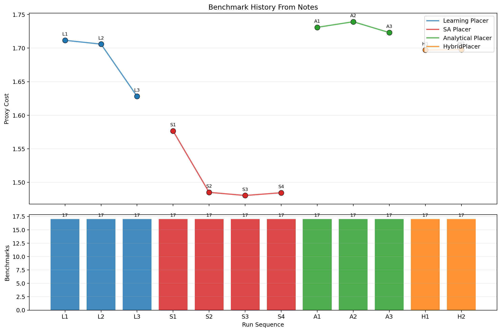

# Benchmark History Summary

This graph summarizes the full-suite benchmark sections logged in the notes.

- Top plot: proxy trend over run history using the logged AVG proxy from each full-suite run.
- Bottom plot: how many benchmarks were logged in each included run.

## Included Runs

| Run ID | Method | Date | Scope | Plotted Proxy | Benchmarks Logged |
|--------|--------|------|-------|---------------|-------------------|
| L1 | Learning Placer | 2026-04-03 | full_suite | 1.7117 | 17 |
| L2 | Learning Placer | 2026-04-04 | full_suite | 1.7060 | 17 |
| L3 | Learning Placer | 2026-04-04 | full_suite | 1.6282 | 17 |
| S1 | SA Placer | 2026-04-03 | full_suite | 1.5765 | 17 |
| S2 | SA Placer | 2026-04-04 | full_suite | 1.4850 | 17 |
| S3 | SA Placer | 2026-04-04, v2 | full_suite | 1.4803 | 17 |
| S4 | SA Placer | 2026-04-05 | full_suite | 1.4844 | 17 |
| A1 | Analytical Placer | 2026-04-03 | full_suite | 1.7310 | 17 |
| A2 | Analytical Placer | 2026-04-04 | full_suite | 1.7394 | 17 |
| A3 | Analytical Placer | 2026-04-05 | full_suite | 1.7232 | 17 |
| H1 | HybridPlacer | 2026-04-03 | full_suite | 1.6972 | 17 |
| H2 | HybridPlacer | 2026-04-04, --no-media | full_suite | 1.6977 | 17 |

Raw parsed data: [benchmark_history_raw.md](benchmark_history_raw.md)
